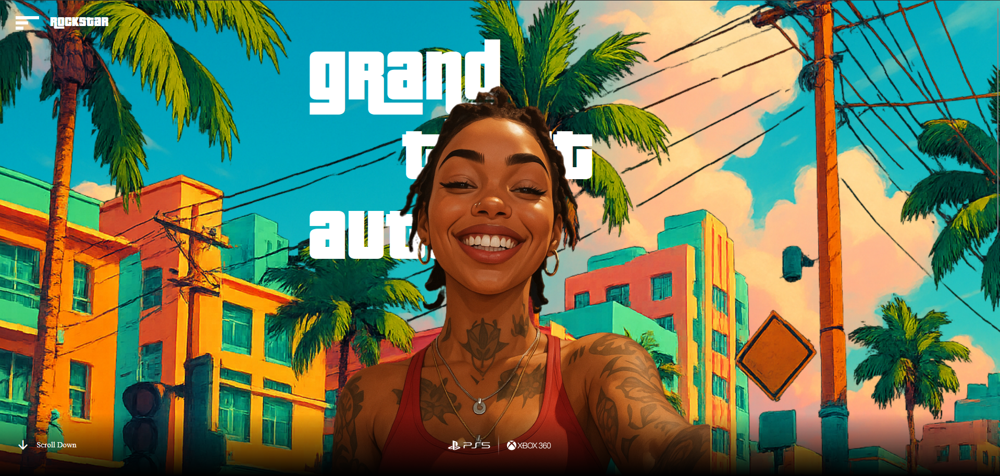
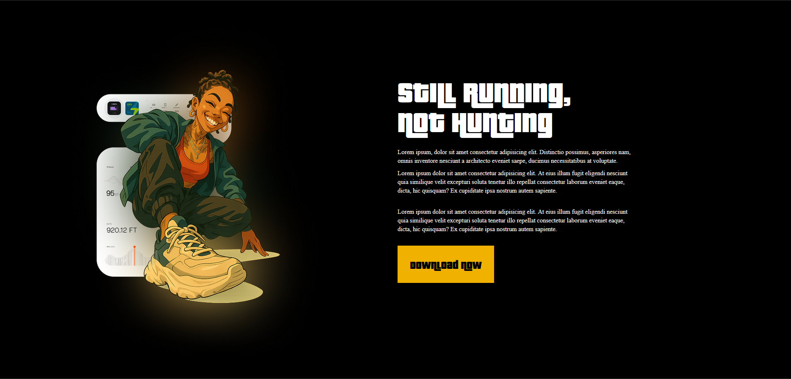

# 🎮 GTA VI Inspired Website

A visually rich **GTA VI–inspired web experience** built using **React, Vite, Tailwind CSS, and GSAP**, focusing on smooth animations, modern UI, and high-performance rendering.

---

## 📖 Description

This project is a cinematic, game-inspired website concept based on **GTA VI aesthetics**.  
It showcases smooth transitions, animated elements, and a bold visual style using modern frontend technologies.  
The goal is to deliver an immersive UI experience inspired by next-gen gaming interfaces.

---

## ✨ Features

- 🎥 Cinematic, game-inspired UI  
- ⚡ High-performance build using Vite  
- 🎨 Modern styling with Tailwind CSS  
- 🌀 Smooth animations powered by GSAP  
- 🧩 Component-based React architecture  
- 📱 Fully responsive layout  
- 🚀 Optimized for fast loading and smooth interactions  

---

## 🛠 Tech Stack

  
  
  
  

---

## 🖼️ Preview
### 🔹 Section 1:

### 🔹 Section 2:

---

## 👤 Author

**Utkarsh Kashid**

If you like this project, feel free to ⭐ the repository and share your feedback.
